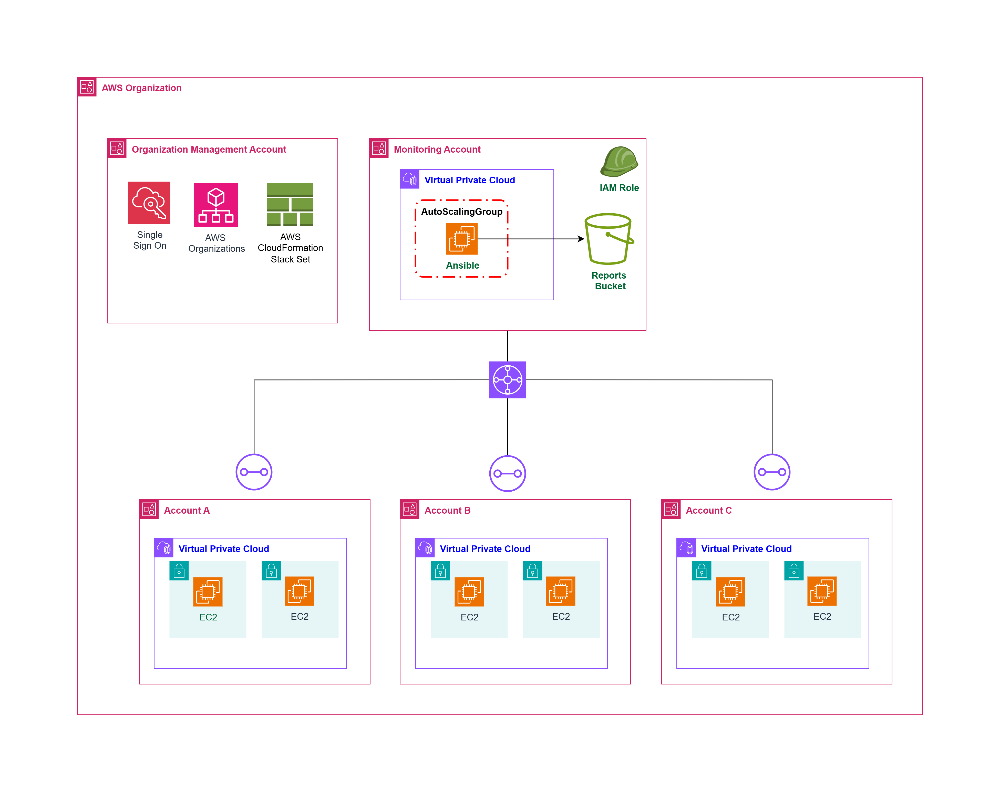
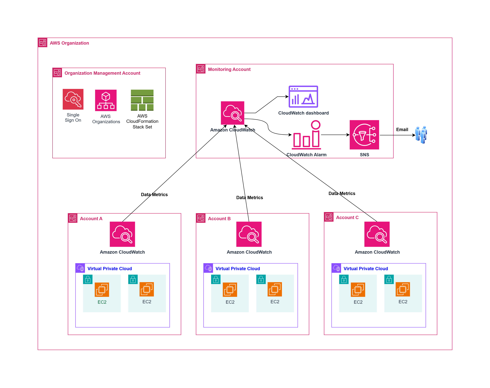
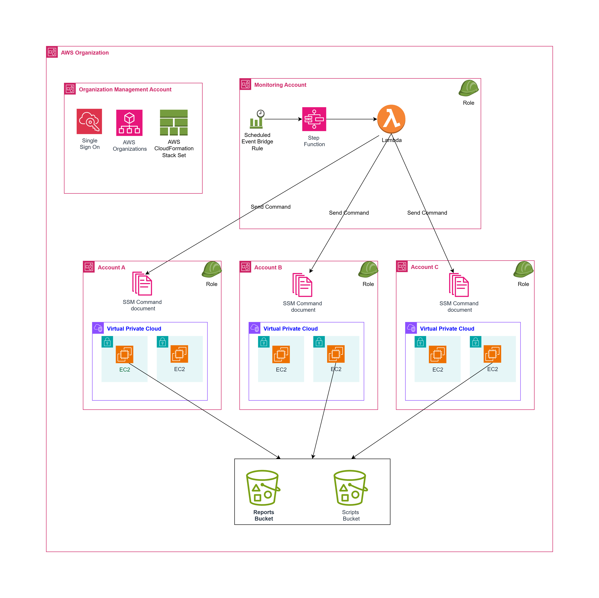

# EC2 Disk Utilization Monitoring with Ansible

An automated solution for monitoring disk utilization across multiple AWS accounts and multiple regions in an Organization and EC2 instances using Ansible, with centralized reporting to S3.

## Key Highlights

- **Cross-Account Roles**: Use AWS IAM cross-account roles to allow the Ansible control node in the central monitoring account to assume roles in other accounts.
- **Dynamic Inventory**: The inventory can be dynamically expanded as new AWS accounts are added, requiring only minimal changes in the configuration.
- **Dynamic Reporting**: The report is generated dynamically based on the current state of EC2 instances and their disks.
- **S3 Bucket**: Use an S3 bucket in the central monitoring account to store the collected disk utilization data in CSV format.
- **Ansible Playbook**: Collect disk utilization data and aggregate it into a report.
- **Network Requirements**: Make sure ports 22 (SSH) and 443 (HTTPS) are opened.
- **Transit Gateway**: Used for Hub-Spoke communication between accounts.
- **AWS Access**: Access to the AWS accounts is managed via Identity-Center and AWS Organizations.

## Overview

This project provides an automated way to:
- Set up AWS profiles for multiple accounts in an AWS Organization
- Collect disk utilization metrics from EC2 instances across accounts
- Generate CSV reports with disk usage data
- Upload reports to S3 for centralized storage and analysis

## Architecture

This solution offers three implementation options for monitoring disk utilization across multiple AWS accounts.

### Option 1: Ansible-Based Direct Monitoring

The solution consists of three main components:

1. **Account Setup** (`accounts.yml`) - Configures AWS profiles for multiple accounts
2. **Disk Monitoring** (`disk-metrics.yml`) - Collects disk metrics from EC2 instances
3. **Dynamic Inventory** - Auto-generated inventory files for each AWS account

This solution assumes the Ansible controller is running on an EC2 instance in the Central AWS account with an instance profile attached that provides the necessary permissions, policy granting required permissions to the IAM role is available in the repo **ansible-controller-policy.json**

#### Architecture Diagram - Option 1



The diagram above illustrates how the Ansible controller in the central account manages EC2 instances across multiple accounts and regions:

- **Central AWS Account**: Contains the Ansible controller EC2 instance and S3 bucket for reports
- **Child AWS Accounts**: Contain EC2 instances that need to be monitored
- **Transit Gateway**: Provides network connectivity between accounts
- **IAM Roles**: Enable cross-account access via AssumeRole

### High Availability Setup

To prevent the Ansible controller from becoming a single point of failure, it's recommended to deploy it within an Auto Scaling Group:

- **Auto Scaling Group**: Maintains desired capacity of Ansible controller instances
- **Launch Template**: Includes user data script to install Ansible and clone the repository

This setup ensures that if the Ansible controller instance fails, a new one will automatically be provisioned and configured to continue monitoring operations.

## Prerequisites

- EC2 instance in Central AWS account with appropriate instance profile
- Ansible 2.9+
- AWS CLI installed
- EC2 instances tagged with `Monitor: yes` for monitoring
- SSH access to target EC2 instances (port 22 open)
- HTTPS access for AWS API calls (port 443 open)
- Cross-account IAM roles deployed across target accounts
- Transit Gateway connectivity between accounts

### Required AWS Permissions

#### Ansible Controller Instance Profile

The EC2 instance running Ansible should have an instance profile with the following permissions:
- `organizations:ListAccountsForParent`
- `ec2:DescribeInstances`
- `s3:PutObject` # on reports s3 bucket
- `sts:AssumeRole` (for cross-account access)

A sample IAM policy is provided in `ansible-controller-policy.json`.

### Cross-Account Role Setup

Before running the playbooks, deploy the IAM role across all target accounts using AWS CloudFormation StackSets:

1. **Deploy the CloudFormation template**: Use the provided `ansible-role.yml` template to create a StackSet
2. **Target deployment**: Deploy across your Organization or specific OUs
3. **Required parameters**:
   - `CentralAccountId`: Your Ansible controller's AWS account ID
   - `RoleName`: Role name (default: `ansible_collector`)

#### StackSet Deployment Commands

```bash
# Create StackSet
aws cloudformation create-stack-set \
  --stack-set-name ansible-collector-roles \
  --template-body file://ansible-role.yml \
  --parameters ParameterKey=CentralAccountId,ParameterValue=123456789012 \
  --capabilities CAPABILITY_NAMED_IAM

# Deploy to Organization
aws cloudformation create-stack-instances \
  --stack-set-name ansible-collector-roles \
  --deployment-targets OrganizationalUnitIds=ou-ho27-9do7jpuw \
  --regions ap-south-1
```

## Installation

### Installing Ansible

Install Ansible on your controller machine following the [official Ansible installation guide](https://docs.ansible.com/ansible/latest/installation_guide/intro_installation.html).

For Ubuntu/Debian:
```bash
sudo apt update
sudo apt install ansible
```

For Amazon Linux/RHEL/CentOS:
```bash
sudo yum install ansible
```

Using pip (recommended for version control):
```bash
python3 -m pip install ansible
```

### Single Instance Setup

1. Launch an EC2 instance in your Central AWS account with the appropriate instance profile attached (see `ansible-controller-policy.json` for required permissions).

### Auto Scaling Group Setup 

1. Create a Launch Template with the following configuration:
   - AMI: Amazon Linux 2 or Ubuntu Server
   - Instance Type: t3.small (minimum)
   - IAM Instance Profile: ansible-controller-role
   - User Data script to:
     - Install Ansible and required packages (see Installing Ansible section)
     - Fetch SSH key(s) from secure storage (S3 or Parameter Store)
     - Clone repository and install dependencies


2. Create an Auto Scaling Group:
   - Use the Launch Template
   - Configure desired capacity: 1
   - Enable instance health checks
   - Configure across multiple Availability Zones

3. Clone this repository:
```bash
git clone <repository-url>
cd <repository-name>
```

4. Install required Ansible collections:
```bash
ansible-galaxy collection install -r requirements.yml
```

5. Configure your variables in `group_vars/all.yaml`

## Configuration

### Global Variables (`group_vars/all.yaml`)

```yaml
# SSH Configuration
ansible_ssh_private_key_file: ansible.pem # replace with your ssh key name
ansible_ssh_user: ubuntu # replace with username to ssh 

# AWS Organization Configuration
ou_ids:
  - ou-ho27-9do7jpuw  # Replace with your OU IDs

# AWS Settings
regions:
  - us-east-1
  - ap-south-1
  - us-west-2
role_name: ansible_collector
aws_config_path: "~/.aws/config"

# S3 Configuration
s3_bucket_name: "my-ec2-disk-reports" # replace with your bucket name
s3_report_path: "disk_utilization_reports/" # path inside s3 bucket
local_report_path: "/tmp/disk_utilization_report.csv" 
```

## Usage

### Step 1: Set Up AWS Profiles

Generate AWS profiles for all accounts in your organization:

```bash
ansible-playbook accounts.yml
```

This will:
- Query AWS Organizations for account details
- Create AWS CLI profiles for each account
- Generate dynamic inventory files in `inventory` folder
- Create `vars/account_vars.yml` with account information

### Step 2: Run Disk Monitoring

Collect disk utilization metrics from all monitored instances:

```bash
ansible-playbook disk-metrics.yml -i inventory/
```

This will:
- Generate a CSV report header
- Collect disk usage from all EC2 instances tagged with `Monitor: yes`
- Compile data into a CSV file
- Upload the report to S3
- Clean up local temporary files

### Manual Execution for Specific Account

To run monitoring for a specific account:

```bash
ansible-playbook disk-metrics.yml -i inventory/<account-name>_<region>_aws_ec2.yml
```

## Output Format

The generated CSV report includes the following columns:

| Column | Description |
|--------|-------------|
| Account ID | AWS Account ID |
| Region | AWS Region |
| Instance ID | EC2 Instance ID |
| Device Name | Disk device name (e.g., /dev/xvda1) |
| Total Size | Total disk size |
| Used Size | Used disk space |
| Remaining Size | Available disk space |
| Disk Use % | Percentage of disk usage |

## File Structure

```
.
├── accounts.yml                  # AWS account setup playbook
├── disk-metrics.yml              # Disk monitoring playbook
├── ansible-role.yml              # CloudFormation template for cross-account role
├── ansible-controller-policy.json # IAM policy for Ansible controller instance
├── ansible.pem                   # SSH private key (add your key here)
├── requirements.yml              # Ansible collection requirements
├── architecture-diagram.drawio   # Architecture diagram source file
├── images/                      # Directory containing images
│   ├── architecture-diagram.png  # Architecture diagram for Option 1
│   ├── architecture-diagram-option2.png  # Architecture diagram for Option 2
│   └── architecture-diagram-option3.png  # Architecture diagram for Option 3
├── group_vars/
│   └── all.yaml                 # Global variables
├── inventory/                   # Auto-generated inventory files
│   └── <account>_aws_ec2.yml
├── vars/
│   └── account_vars.yml         # Auto-generated account variables
└── README.md
```

### SSH Private Key Setup

1. **Add your private key**: Place your EC2 SSH private key file as `ansible.pem` in the project root directory
2. **Set proper permissions**: 
   ```bash
   chmod 400 ansible.pem
   ```
3. **Key requirements**: The private key must correspond to the key pair associated with your EC2 instances
4. **Alternative key names**: If using a different key name, update the `ansible_ssh_private_key_file` variable in `group_vars/all.yaml`

## EC2 Instance Requirements

Target EC2 instances must:
- Be in `running` state
- Have the tag `Monitor: yes`
- Be accessible via SSH using the configured key
- Have the `df` command available (standard on most Linux distributions)


## Troubleshooting

### Common Issues

1. **SSH Connection Failures**
   - Verify SSH key path and permissions
   - Check security group rules allow SSH access
   - Ensure instances have public IPs or are accessible via bastion

2. **AWS Profile Issues**
   - Verify IAM roles exist in target accounts
   - Check cross-account trust relationships
   - Ensure role names match configuration

3. **S3 Upload Failures**
   - Verify S3 bucket exists and is accessible
   - Check IAM permissions for S3 operations
   - Ensure bucket policy allows uploads

### Debug Mode

Run playbooks with verbose output:

```bash
ansible-playbook disk-metrics.yml -i inventory/ -vvv
```

## Security Considerations

- Store SSH private keys securely with appropriate permissions (400)
- Never commit private keys to version control (add `*.pem` to `.gitignore`)
- Use IAM roles with minimal required permissions
- Enable S3 bucket encryption and access logging
- Regularly rotate SSH keys
- When using Auto Scaling Group, store sensitive data in AWS Systems Manager Parameter Store or s3 and fetch the data using user scripts.
- For CloudWatch Option, ensure IAM roles follow the principle of least privilege
- Encrypt SNS topics that contain sensitive information
- Use AWS Organizations Service Control Policies to enforce security guardrails

### Option 2: CloudWatch Cross-Account Observability

An alternative approach leverages Amazon CloudWatch cross-account observability to monitor disk utilization metrics:

1. **CloudWatch Agent** - Installed on all EC2 instances to collect disk metrics
2. **CloudWatch Cross-Account Observability** - Enables central monitoring of metrics from multiple accounts
3. **CloudWatch Dashboards & Alarms** - Provides visualization and alerting capabilities
4. **SNS Notifications** - Sends alerts when disk utilization thresholds are exceeded

#### Architecture Diagram - Option 2



Key components of this approach:

- **Central Monitoring Account**: Contains CloudWatch dashboards, alarms, and SNS topics
- **Source Accounts**: EC2 instances with CloudWatch Agent installed
- **CloudFormation StackSets**: Deploy cross-account observability configuration at scale
- **SNS Topics**: Send email notifications when disk thresholds are reached

## CloudWatch Implementation Details

### CloudWatch Cross-Account Observability

The CloudWatch-based solution (Option 2) leverages A### CloudWatch Cross-Account Observability Setup

If implementing Option 2 with CloudWatch, follow these steps to set up cross-account observability:

1. **Set up a central monitoring account** that will collect and visualize metrics from all source accounts

2. **Deploy CloudFormation StackSets** to configure cross-account observability across your organization:
   - Create IAM roles in source accounts to allow the monitoring account access
   - Configure CloudWatch Agent installation and configuration
   - Set up metric sharing permissions

3. **Install CloudWatch Agent** on all EC2 instances to collect disk metrics

4. **Create CloudWatch Dashboards** in the central account to visualize disk metrics across all accounts

5. **Configure CloudWatch Alarms** to trigger when disk utilization exceeds thresholds

6. **Set up SNS Topics** to send email notifications when alarms are triggered


## CloudWatch Implementation Details

### CloudWatch Cross-Account Observability

The CloudWatch-based solution (Option 2) leverages Amazon mazon CloudWatch cross-account observability to provide a comprehensive monitoring solution:

- **Centralized Monitoring**: Search, analyze, and correlate telemetry data (metrics, logs, and traces) across all accounts from a single central account
- **Unified Dashboards**: Create dashboards that visualize metrics from multiple accounts in one place
- **Cross-Account Alarms**: Configure alarms that evaluate metrics from other accounts
- **Rapid Troubleshooting**: Search and audit logs across applications to identify operational issues quickly

### Implementation Steps

1. **Configure CloudWatch Agent**:
   - Install the CloudWatch agent on all EC2 instances
   - Configure the agent to collect disk utilization metrics
   - Set appropriate collection intervals

2. **Set Up Cross-Account Observability**:
   - In the monitoring account, create an observation link using the AWS Organization ID or specific OU IDs
   - This automatically includes all accounts in the organization or specified OUs

3. **Create CloudWatch Dashboards**:
   - Design dashboards that display disk utilization across all accounts
   - Include filters for accounts, regions, and instance types

4. **Configure Alarms**:
   - Set up alarms for different threshold levels (warning, critical)
   - Link alarms to SNS topics for notification

5. **Notification System**:
   - Create SNS topics for different severity levels
   - Subscribe email endpoints to receive notifications
   - Optionally integrate with ticketing systems

### Scaling with AWS Organizations

The solution scales automatically as new accounts are added to your AWS Organization:

- New accounts added to the organization are automatically included in monitoring
- CloudFormation StackSets deploy necessary IAM roles and configurations to new accounts
- CloudWatch Agent installation can be automated using Systems Manager or Ansible

### Integration with Ansible

While CloudWatch provides the monitoring infrastructure, Ansible can still be utilized to:

- Automate CloudWatch Agent installation across accounts
- Pull metrics from CloudWatch for custom reporting
- Perform remediation actions based on CloudWatch alarms


#### Benefits of CloudWatch-Based Monitoring

- **Real-time Monitoring**: Continuous monitoring with near real-time metrics
- **Proactive Alerting**: Receive notifications before disk space becomes critical
- **Visual Dashboards**: Comprehensive view of disk utilization across all accounts
- **Scalability**: Easily add new accounts through AWS Organizations integration
- **Historical Data**: Access to historical metrics for capacity planning

## Option 3: Serverless Approach with Step Functions and Lambda

### Architecture Diagram - Option 3



This serverless approach uses AWS Step Functions and Lambda to orchestrate disk utilization monitoring across multiple accounts and regions:

### Key Components

1. **Step Functions Workflow**: Orchestrates the entire monitoring process
   - Takes OU IDs and regions as input parameters
   - Triggers Lambda function to perform monitoring tasks

2. **Lambda Function**: Core processing component that:
   - Fetches accounts from specified OUs
   - Assumes IAM roles in target accounts
   - Executes SSM commands in each region
   - Processes and aggregates results

3. **Systems Manager (SSM)**: Executes commands on target instances
   - Uses resource groups to target instances with specific tags
   - Runs scripts to collect disk metrics
   - Uploads results to centralized S3 bucket

4. **CloudFormation StackSets**: Deploys required resources across accounts
   - IAM roles for cross-account access
   - SSM documents containing monitoring scripts
   - Resource groups for targeting instances

### Implementation Process

1. **Deploy Infrastructure**: Use CloudFormation StackSets to deploy:
   - Cross-account IAM roles
   - SSM Run Documents
   - Required permissions

2. **Configure Step Functions**: Create a workflow that:
   - Accepts OU IDs and regions as input
   - Invokes Lambda with appropriate parameters
   - Handles error conditions and retries

3. **Develop Lambda Function**: Implement logic to:
   - Query AWS Organizations API for accounts in specified OUs
   - Assume roles in each account
   - Execute SSM commands targeting instances with specific tags
   - Monitor execution status

4. **Create SSM Documents**: Define scripts that:
   - Collect disk utilization metrics
   - Format data into CSV format
   - Upload results to centralized S3 bucket

### Benefits of the Serverless Approach

- **Fully Managed**: No infrastructure to maintain
- **Cost-Effective**: Pay only for actual execution time
- **Highly Scalable**: Automatically scales to handle any number of accounts and regions
- **Centralized Control**: Single workflow manages the entire monitoring process
- **Flexible Scheduling**: Can be triggered on demand, scheduled, or event-driven
- **Detailed Logging**: Comprehensive execution history and logs

## Solution Comparison Matrix

| Criteria | Option 1: Ansible-Based | Option 2: CloudWatch | Option 3: Serverless |
|---------|------------------------|---------------------|---------------------|
| **Initial Setup Complexity** | Medium | High | Medium |
| **Maintenance Effort** | Medium | Low | Very Low |
| **Real-time Monitoring** | No (scheduled runs) | Yes | No (scheduled runs) |
| **Alerting Capabilities** | Limited (requires additional setup) | Requires integration with SNS | Requires integration with SNS |
| **Visualization** | Custom reporting required | Built-in dashboards | Custom reporting required |
| **Cost Structure** | EC2 instance costs + minimal AWS API calls + data transfer cost |  CloudWatch costs per metric + data transfer cost | Pay-per-execution (Lambda, Step Functions, SSM) + data trabsfer cost |
| **Cost Efficiency** | Medium | High for large deployments | Highest for infrequent monitoring |
| **Scalability (# of Accounts)** | Good | Excellent | Excellent |
| **Scalability (# of Instances)** | Good | Excellent | Excellent |
| **Historical Data** | Stored in S3 (custom retention) | Built-in metrics retention | Stored in S3 (custom retention) |
| **Operational Overhead** | EC2 maintenance required | CloudWatch Agent maintenance | SSM agent maintenance (can be automated) |
| **Failure Recovery** | Requires ASG setup | Built-in redundancy | Built-in redundancy |
| **Best For** | Existing Ansible users, custom reporting needs | Real-time monitoring, alerting, visualization | Cost optimization, minimal maintenance, infrequent checks |
